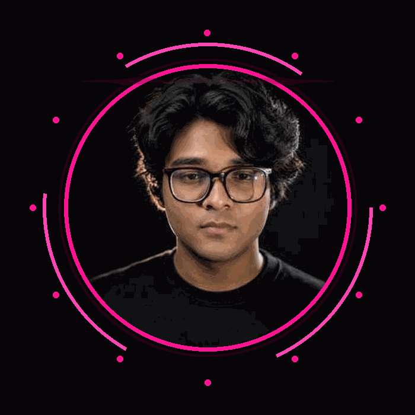

  

  

  

  

  

<h3 align="center">About Me</h3>

  I am a B.Tech CSE student passionate about technology, problem solving, and building real-world projects.
   
  I currently work with C and C++, and I am exploring Android Development, AI, and Machine Learning.
   
  My current project is <b>KAVACH</b> — a Smart Safety & Emergency Response App.

  

  

